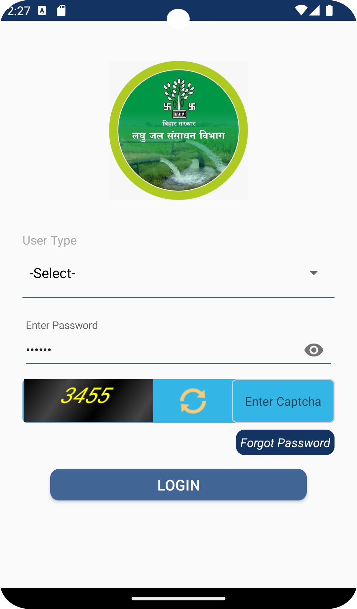
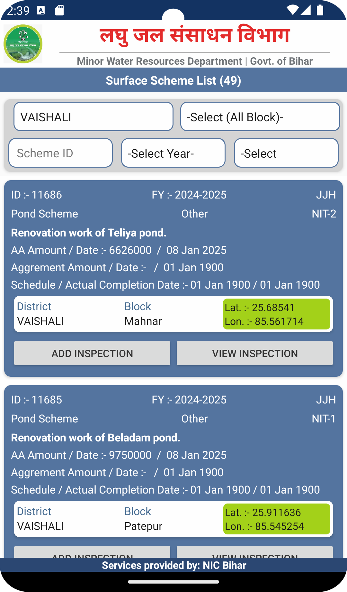

# BRDS Inspection App

[](https://flutter.dev/)

A mobile application developed for the Minor Water Resources Department, Government of Bihar, to facilitate inspection and monitoring tasks.

## Features

- **User Authentication**: Secure login system for authorized personnel
- **Responsive Design**: Adapts to different screen sizes and orientations
- **Dark/Light Mode**: Supports both light and dark themes based on system preferences
- **Intuitive UI**: Clean and user-friendly interface with easy navigation
- **Bilingual Support**: Displays content in both Hindi and English

## Screenshots

| Login Screen | Home Screen |
|--------------|-------------|
|  |  |

## Getting Started

### Prerequisites

- Flutter SDK (latest stable version)
- Dart SDK (latest stable version)
- Android Studio / Xcode (for emulator/simulator)
- VS Code or Android Studio (for development)

### Installation

1. Clone the repository:
   ```bash
   git clone <repository-url>
   cd myapp1
   ```

2. Install dependencies:
   ```bash
   flutter pub get
   ```

3. Run the app:
   ```bash
   flutter run
   ```

## Project Structure

```
lib/
├── app/
│   ├── modules/
│   │   ├── home/
│   │   │   ├── controllers/
│   │   │   └── views/
│   │   └── login/
│   │       ├── controllers/
│   │       └── views/
│   ├── routes/
│   │   ├── app_pages.dart
│   │   └── app_routes.dart
│   └── theme/
├── assets/
│   ├── images/
│   └── icons/
└── main.dart
```

## Dependencies

- `get`: State management and dependency injection
- `flutter_svg`: For rendering SVG images
- `shared_preferences`: For local storage of user preferences
- `intl`: For internationalization and localization

## Contributing

Contributions are welcome! Please feel free to submit a Pull Request.

## License

This project is licensed under the MIT License - see the [LICENSE](LICENSE) file for details.

## Acknowledgments

- Minor Water Resources Department, Government of Bihar
- Flutter community for the awesome framework
- All contributors who have helped improve this project

## Contact

For any queries or support, please contact the development team.
